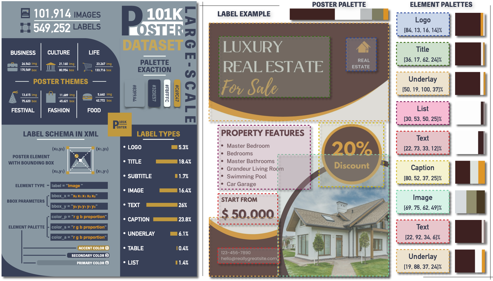

<div align="center">

# Poster101K

**A Large-scale Multi-theme Poster Layout Dataset**

[](#dataset-composition)
[](#dataset-composition)
[](#dataset-composition)
[](#annotation-schema)

Poster images, layout annotations, explicit underlay labels, and poster- and element-level colour palettes.

</div>

## Overview

Poster101K is a large-scale dataset for poster layout analysis and generation. The research corpus contains **101,914 poster records** from six themes and **549,252 manually annotated layout elements** from nine semantic categories. In addition to common foreground elements, Poster101K explicitly annotates underlays: background shapes or blocks used to support, group, or separate foreground content.

Poster101K also provides automatically extracted colour palettes at two levels. Each complete poster has a five-colour palette, and each annotated element crop has a three-colour palette. These annotations support research on poster geometry, layered composition, semantic element relationships, and the connection between layout and colour.

The public release is organized separately from the research corpus. Raw images will be included only for records whose redistribution basis has been verified and documented. Other eligible records may be released as annotations and metadata without the original image. 


<p align="center">
  
</p>


## Key features

- **Large scale:** 101,914 poster records and 549,252 annotated elements.
- **Multi-theme coverage:** food, festival, life, business, culture, and fashion.
- **Nine semantic categories:** logo, title, subtitle, underlay, text, image, caption, table, and list.
- **Explicit underlay annotations:** support the study of grouping and layered poster composition.
- **Two-level colour information:** five colours per poster and three colours per annotated element crop.

## Download
This repository does not store data files directly. Please obtain them through the following link:
- Recommended download source (Kaggle)：[Kaggle](https://www.kaggle.com/datasets/flylyisflying93/poster101k)


## Dataset composition

| Theme | Poster records | Annotated elements | Elements per poster |
|---|---:|---:|---:|
| Food | 5,640 | 42,772 | 7.58 |
| Festival | 13,615 | 75,620 | 5.55 |
| Life | 23,267 | 133,716 | 5.75 |
| Business | 26,543 | 170,569 | 6.43 |
| Culture | 21,160 | 80,954 | 3.83 |
| Fashion | 11,689 | 45,621 | 3.90 |
| **Total** | **101,914** | **549,252** | **5.39** |

Element counts include underlays.

## Collection and curation

Poster candidates were retrieved from five publicly accessible design platforms. Items displayed as free by a platform were eligible for research collection, but free accessibility was not treated as evidence of permission to redistribute an image.

| Source platform | Retrieved candidates |
|---|---:|
| Wepik | 15,687 |
| Fotor | 21,463 |
| Canva | 35,312 |
| Gaoding | 24,804 |
| Pinterest | 29,358 |
| **Total** | **126,624** |

Filtering was completed before constructing the train, validation, and test subsets. Each removed poster is counted once in the first stage at which it was excluded.

| Curation stage | Removed | Remaining |
|---|---:|---:|
| Raw retrieval | -- | 126,624 |
| File-integrity filter | 9,539 | 117,085 |
| Near-duplicate removal | 7,431 | 109,654 |
| Content and quality filter | 7,740 | 101,914 |
| Final research dataset | -- | 101,914 |

The filtering process removes corrupted files, low-resolution images, incomplete canvases, invalid aspect ratios, duplicates, and low-quality content.

## Dataset organization

```text
Poster101K-v1.0/
├── images/                # Rights-verified images only
│   ├── Business/
│   ├── Culture/
│   ├── Fashion/
│   ├── Festival/
│   ├── Food/
│   └── Life/
└── annotations_withColor/
    ├── Business_annotation/xml/
    ├── Culture_annotation/xml/
    ├── Fashion_annotation/xml/
    ├── Festival_annotation/xml/
    ├── Food_annotation/xml/
    └── Life_annotation/xml/

```

## XML annotation example

```xml
<annotation>
  <filename>Business_1</filename>
  <category>Business</category>
  <size>
    <width>1000</width>
    <height>1779</height>
  </size>
  <palette>
    <color rgb_p="14 29 36 0.35" />
    <color rgb_p="221 225 224 0.28" />
    <color rgb_p="170 185 177 0.19" />
    <color rgb_p="134 119 109 0.097" />
    <color rgb_p="19 105 95 0.09" />
  </palette>
  <layout>
    <element label="Logo" polygon_x="59 297 297 59 59" polygon_y="60 60 147 147 60" color_1="205 219 213 0.53" color_2="149 181 173 0.25" color_3="18 97 83 0.22" />
    <element label="Logo" polygon_x="333 595 595 333 333" polygon_y="51 51 159 159 51" color_1="230 233 235 0.64" color_2="182 207 201 0.19" color_3="21 98 85 0.16" />
    <element label="Title" polygon_x="77 420 420 77 77" polygon_y="1044 1044 1209 1209 1044" color_1="9 22 29 0.74" color_2="245 163 174 0.21" color_3="129 94 103 0.044" />
    <element label="Title" polygon_x="68 542 542 68 68" polygon_y="1259 1259 1374 1374 1259" color_1="9 18 25 0.79" color_2="238 240 241 0.14" color_3="119 125 128 0.064" />
    <element label="Subtitle" polygon_x="79 304 304 79 79" polygon_y="1396 1396 1471 1471 1396" color_1="7 14 20 0.77" color_2="240 241 242 0.17" color_3="121 125 128 0.058" />
    <element label="Caption" polygon_x="75 553 553 75 75" polygon_y="1524 1524 1587 1587 1524" color_1="10 16 23 0.61" color_2="242 172 185 0.35" color_3="119 89 99 0.042" />
    <element label="Text" polygon_x="51 253 253 51 51" polygon_y="453 453 498 498 453" color_1="205 219 211 0.46" color_2="153 181 172 0.42" color_3="54 112 98 0.12" />
    <element label="Text" polygon_x="51 158 158 51 51" polygon_y="577 577 771 771 577" color_1="162 190 183 0.58" color_2="197 217 209 0.29" color_3="45 109 95 0.13" />
  </layout>
</annotation>
```

In `rgb_p`, the first three values are the sRGB components and the fourth value is the color proportion.


## Suggested research uses

Poster101K is intended to support research on:

- graphic and poster layout analysis;
- unconditional and conditional layout generation;
- layout completion and refinement;
- poster element detection and semantic layout understanding;
- underlay-aware grouping and overlap analysis;
- theme-conditioned layout statistics;
- colour-palette analysis; and
- joint layout-and-colour generation.

The dataset is not intended to provide unrestricted commercial rights to the original poster images or to serve as a source of standalone graphic assets.

## Limitations

- Poster101K draws from five platforms and six themes, so it does not represent every poster style, language, region, or cultural setting.
- The annotations use axis-aligned rectangles and therefore do not capture irregular element boundaries.
- The nine-category schema does not encode typography, reading order, z-order, text semantics, or negative space.
- Colour palettes are automatically extracted and have not been manually validated as ground-truth colour annotations.
- Aggregate IoU measures geometric intersection but cannot distinguish intentional overlap from accidental collision.

## Feedback
Suggestions and opinions on this dataset (both positive and negative) are welcome. Please contact the author by sending an email to wangf21@m.fudan.edu.cn.

## Citation

No single license applies automatically to every material associated with Poster101K.

- Author-created documentation, annotations, metadata, and scripts are covered only by the licenses explicitly assigned to those materials.
- Third-party poster images, when included, are not relicensed by the documentation, annotation, or code license.
- Public accessibility or a “free” label on a source platform was not treated as evidence of permission to redistribute an image.

This dataset is open source under [CC BY-NC-ND 4.0](LICENSE) license. For commercial purposes, please contact Dr. Fei Wang at wangf21@m.fudan.edu.cn or Prof. Shuigeng Zhou at sgzhou@fudan.edu.cn.

```bibtex
@dataset{poster101k,
  year = {2026},
  title = {Poster101k: A Large-scale Poster Image Dataset for Graphic Layout Generation},
  publisher = {Kaggle},
  version = {1.0},
  url = {https://www.kaggle.com/datasets/flylyisflying93/poster101k}
}
```

## Acknowledgements

We thank the data curators and annotators of Poster101K for their contributions.

